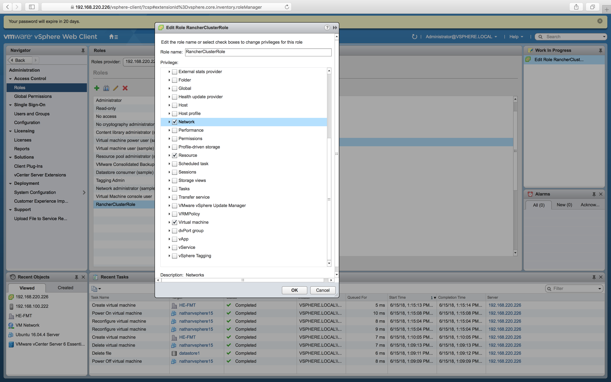

Use  to create a Kubernetes cluster in vSphere.

Before setting up a Cluster in vSphere, you must ensure that you have a user with sufficient permissions to create a Rancher cluster.

1. From the **vSphere** console go to **Administration** Page.

2. Go to the **Roles** tab.

3. Create a new *Role*.  Give it a name and select the **Datastore**, **Network**, **Resource**, and **Virtual machine** *privileges*.

4. Go to the **Users and Groups** tab.

5. Create a new *User*. Fill out the form and then click **ok**. Make sure to note the username and password as you will need it when creating a cluster in Rancher.

6. Go to the **Global Permissions** tab.

7. Create a new *Global Permission*.  Add the *User* you created earlier and assign it the Role you created earlier. Click **ok**.

Now you have a user that is able to successfully create and manager Rancher clusters in vSphere.

To create the cluster.

1. From the **Clusters** page, click **Add Cluster**.

2. Choose **vSphere**.

3. Enter a **Cluster Name**.

4. 

5. 

6. 

	1.	Click **Add Node Template**.

	2.	Use the **vSphere Options** to authenticate with vSphere and provision your cluster.

		- **Account Access** holds the host name for your vCenter host and your credentials for authentication.

		- **Instance Options** are used to provision your cluster's VMs.

		- **Scheduling** is used to choose the hypervisor your virtual machines will be scheduled to.

	3. 

	4. Click **Create**.

	5. **Optional:** Add additional node pools.

 
7. Review your options to confirm they're correct. Then click **Create**.


